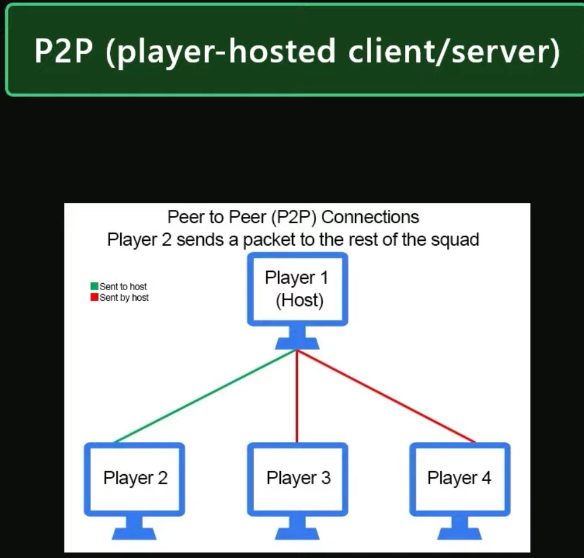

# Design

Solar system is a suite libraries for a game server which aims to easily allow for programmers to set up and use a 
player hosted server for their games. 

This document will outline the design and details about the implementation.

## Networking

The first layer on the SolarSystem suite is called Satellite which will act as a "transport layer". This library will 
act as a "wrapper" around pure UNIX sockets, and will use [R-UDP](https://en.wikipedia.org/wiki/Reliable_User_Datagram_Protocol) 
to provide a fast, and reliable transport of packages. Orbit will be asynchronous, as it will be running on an 
ulterior thread.

After Satellite, the next layer is SpaceStation. SpaceStation offers more utilities for making your server, such as Lua 
scripting, matchmaking, player management, etc. SpaceStation will provide a small wrapper over Satellite, as packets 
will also be managed with SpaceStation 

The reference implementation will serve as both an example and a working server. This will be an external program also
written in C, to showcase the power of the Solar System library.

>  
> [Source](https://www.youtube.com/watch?v=77vYKsXC4IE&t=325s)

